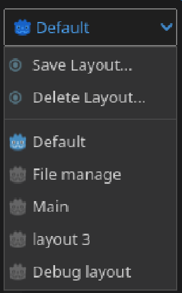
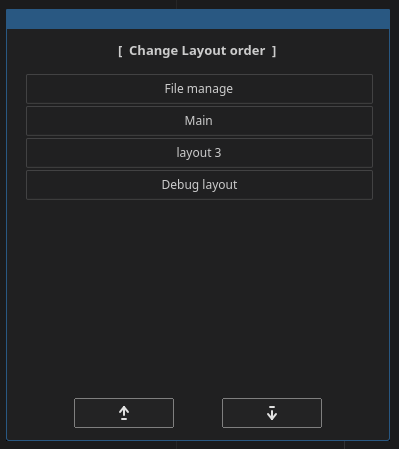
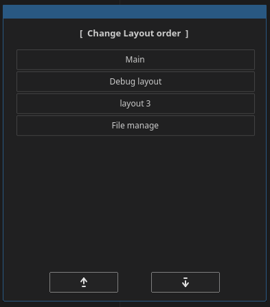

[&labelColor=deepskyblue)](./LICENSE)

# Layout tools

  - This addon lets you quickly switch between different layouts in the Godot editor with ease.

 
 

> [!CAUTION] 
> ### Please save at least one layout before launching.
> 
> ### An error will occur if there are no layouts.

 

## LMB

  - When the addon is activated, it will appear in the upper right corner.  
  - Open it with LMB (Left Mouse Button).

 

## RMB
> 
  - Switch to edit mode. RMB (Right Mouse Button)
  - A box for rearranging layouts will appear in the center.
  - Select the layout you want to move and use the up and down arrows to change its position.

